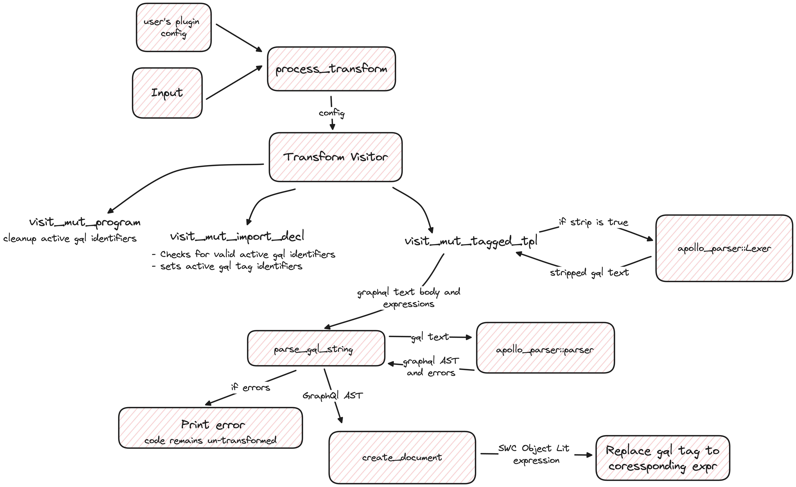

# graphql-tag-swc-plugin

SWC plugin alternative to `babel-plugin-graphql-tag`

## Installation

```
npm install -D graphql-tag-swc-plugin
```

## Usage

### SWC

Add following to swc config (below with default values):

```
jsc: {
  experimental: {
    plugins: [
      ["graphql-tag-swc-plugin",
        {
          importSources: ["@apollo/client", "graphql-tag"],
          gqlTagIdentifiers: ["gql"]
        },
      ],
    ],
  },
},
```

### Next js

Add following to next config (below with default values):

```
experimental: {
  swcPlugins: [
    ["graphql-tag-swc-plugin",
      {
        importSources: ["@apollo/client", "graphql-tag"],
        gqlTagIdentifiers: ["gql"]
      },
    ],
  ],
},
```

## Configuration

Following props are accepted by plugin currently, inline with babel alternative:

1.  `importSources`:
    > default: `["@apollo/client", "graphql-tag"]`

import paths from where gql tag is imported for which plugin should compile graphql

2. `gqlTagIdentifiers`:
   > default: `["gql"]`

Identifier by which graphql-tag will be imported.
Example: Here `import { gql } from "@apollo/client`, `"gql"` is the identifier.

3. `strip`:
   > default: `false`

If true, it pre-process graphql input to remove redundant (like whitespace and comments) characters by passing it through apollo_parser's lexer. This results in smaller AST in some cases and smaller footprint in bundle size.

## Contribution

All contributions are welcome!
For any bug / feature request please create a Pull request with fixture for the same whenever possible.

### Pre-requisites

Here is list of topics and resources to quickly get you up to contributing!

1. Rust: https://www.rust-lang.org/learn

2. AST and Visitors: https://notairy.vercel.app/note/ast and https://patshaughnessy.net/2022/1/22/visiting-an-abstract-syntax-tree

3. SWC: https://swc.rs/

### Architecture

Here is the basic code walkthrough (updated at v0.1.4)


## Authors

- @rishabh3112 - Rishabh Chawla

## License

MIT
